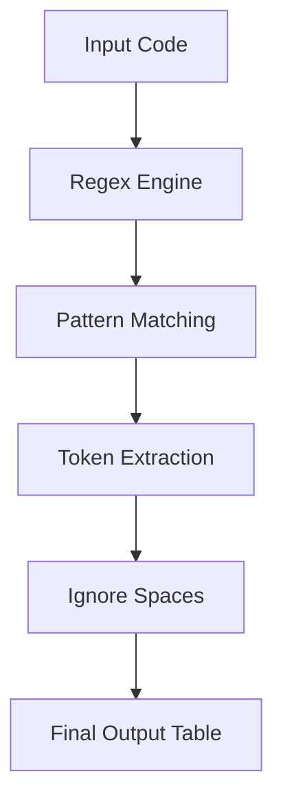

# ⚙️ Compiler Design – Task 1

### *Lexical Analysis using Python (Regex-Based Tokenizer)*

<p align="center">
  
  
  
  
  
</p>

---

<p align="center">
  
</p>

---

## 📌 Overview

This project implements a **Lexical Analyzer (Tokenizer)** the first phase of a compiler using Python and Regular Expressions.

It converts raw source code into structured **tokens**, forming the foundation for parsing and further compilation stages.

---

## ⚡ Quick Glance (10-sec overview)

* 🔍 Converts source code → tokens
* 🧠 Identifies keywords, identifiers, operators, numbers
* ⚙️ Built using efficient regex-based pattern matching
* 📚 Core foundation of compiler design

---

## 🧠 Beginner-Friendly Explanation (A → Z Guide)

### Input Example:

```c
int sum=10;
```

### Output:

`int | sum | = | 10 | ;`

---

## 🎬 Step-by-Step Code Flow (Animated Understanding)

```mermaid
sequenceDiagram
    participant U as User Input
    participant R as Regex Engine
    participant M as Matcher Loop
    participant O as Output

    U->>R: "int sum=10;"
    Note right of R: Apply Master Pattern
    R->>M: Match "int"
    M->>O: KEYWORD

    R->>M: Match "sum"
    M->>O: IDENTIFIER

    R->>M: Match "="
    M->>O: OPERATOR

    R->>M: Match "10"
    M->>O: NUMBER

    R->>M: Match ";"
    M->>O: PUNCTUATION
```

---

## 🔍 Internal Code Flow (Step-by-Step)

### 1️⃣ Define Token Rules

```python
token_patterns = [...]
```

---

### 2️⃣ Combine into Master Pattern

```python
master_pattern = '|'.join(...)
```

---

### 3️⃣ Start Scanning

```python
re.finditer(master_pattern, input_string)
```

---

### 4️⃣ Identify Token Type

```python
match.lastgroup
```

---

### 5️⃣ Extract Token Value

```python
match.group(token_type)
```

---

### 6️⃣ Ignore Whitespace

```python
if token_type != 'WHITESPACE'
```

---

### 7️⃣ Print Output

```python
print(token, type)
```

---

## 🔄 Workflow Diagram



---

## 🧪 Example Execution

### Input

```text
int sum=10; and a+b= 20;
```

### Output

| Token | Type        |
| ----- | ----------- |
| int   | KEYWORD     |
| sum   | IDENTIFIER  |
| =     | OPERATOR    |
| 10    | NUMBER      |
| ;     | PUNCTUATION |
| and   | KEYWORD     |
| a     | IDENTIFIER  |
| +     | OPERATOR    |
| b     | IDENTIFIER  |
| =     | OPERATOR    |
| 20    | NUMBER      |
| ;     | PUNCTUATION |

---

## 🧠 Debugger’s Insight (Expert Level)

* ✔ Regex priority matters (Keyword before Identifier)
* ✔ Named groups improve readability & debugging
* ✔ `finditer()` ensures sequential token detection
* ✔ System is easily extendable

---

## 🛠️ Tech Stack

* Python
* Regular Expressions (`re`)
* Compiler Design Concepts

---

## 🚀 Run the Code

```bash
python Task_1.py
```

---

## 👤 Author

**Abdullah Al Mamun Zishan**
🎓 CSE, Feni University

🔗 LinkedIn: https://www.linkedin.com/in/abdullah-al-mamun-zishan-606550282

---

## ⭐ Final Impression

This project is designed to:

✔ Teach beginners from scratch
✔ Demonstrate real compiler logic
✔ Showcase clean, professional implementation

👉 A perfect blend of **learning + practical execution + portfolio impact**
