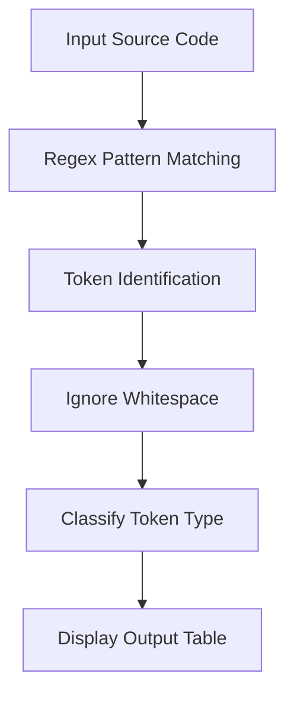

# ⚙️ Compiler Design – Task 1

### *Lexical Analysis using Python (Regex-Based Tokenizer)*

---

## 📌 Overview

This project demonstrates the implementation of a **Lexical Analyzer (Tokenizer)** — the first phase of a compiler — using Python and Regular Expressions.

The system reads an input string and breaks it into meaningful **tokens**, classifying each based on predefined language rules.

---

## 🎯 Objective

* Convert raw source code into **tokens**
* Classify tokens into categories such as:

  * Keywords
  * Identifiers
  * Numbers
  * Operators
  * Punctuation
* Simulate the **initial phase of a compiler pipeline**

---

## 🧠 What is Lexical Analysis?

Lexical Analysis is the process of:

> Scanning source code and converting it into a sequence of tokens for further compilation stages.

Example:

```c
int sum = 10;
```

⬇️ Transforms into:

| Token | Type        |
| ----- | ----------- |
| int   | KEYWORD     |
| sum   | IDENTIFIER  |
| =     | OPERATOR    |
| 10    | NUMBER      |
| ;     | PUNCTUATION |

---

## ⚙️ Implementation Details

### 🔹 Token Definitions

The tokenizer uses **regular expressions** to define token patterns:

```python
token_patterns = [
    ('KEYWORD',    r'\b(int|float|and|or|if|else|while)\b'),
    ('NUMBER',     r'\b\d+\b'),
    ('IDENTIFIER', r'\b[a-zA-Z_][a-zA-Z0-9_]*\b'),
    ('OPERATOR',   r'[=\+\-\*/]'),
    ('PUNCTUATION',r';'),
    ('WHITESPACE', r'\s+'),
]
```

---

### 🔹 Master Pattern Construction

All token patterns are combined into a **single regex expression** using named groups:

```python
master_pattern = '|'.join(f'(?P<{name}>{pattern})' for name, pattern in token_patterns)
```

✔ This allows:

* Efficient scanning
* Direct identification of token type

---

### 🔹 Tokenization Process

```python
for match in re.finditer(master_pattern, input_string):
```

Steps:

1. Scan input string sequentially
2. Match patterns using regex
3. Identify token type via `match.lastgroup`
4. Extract token value
5. Ignore whitespace
6. Print structured output

---

## 🔄 Workflow (Step-by-Step)



---

## 🧪 Example Run

### 🔹 Input

```text
int sum=10; and a+b= 20;
```

### 🔹 Output

| Token | Type        |
| ----- | ----------- |
| int   | KEYWORD     |
| sum   | IDENTIFIER  |
| =     | OPERATOR    |
| 10    | NUMBER      |
| ;     | PUNCTUATION |
| and   | KEYWORD     |
| a     | IDENTIFIER  |
| +     | OPERATOR    |
| b     | IDENTIFIER  |
| =     | OPERATOR    |
| 20    | NUMBER      |
| ;     | PUNCTUATION |

---

## 🛠️ Tech Stack

* **Language:** Python
* **Core Concept:** Regular Expressions (`re` module)
* **Domain:** Compiler Design

---

## 💡 Key Highlights

* ✔ Efficient token classification using regex
* ✔ Clean modular design
* ✔ Demonstrates core compiler fundamentals
* ✔ Scalable for future compiler phases (Parsing, Syntax Analysis)

---

## 🚀 How to Run

```bash
python tokenizer.py
```

---

## 📈 Future Enhancements

* Support for:

  * String literals
  * Comments
  * Multi-character operators (`==`, `<=`, etc.)
* Error handling for invalid tokens
* Integration with **syntax analyzer (parser)**

---

## 👤 Author

**Abdullah Al Mamun Zishan**
🎓 CSE, Feni University

---

## ⭐ Final Note

This project reflects a strong understanding of:

* Compiler fundamentals
* Pattern matching
* Language processing techniques

A solid foundation for building **full-scale compilers and interpreters**.
