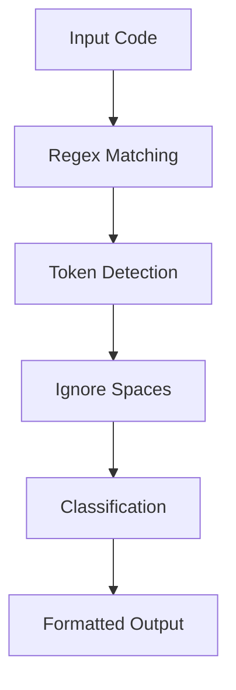

# ⚙️ Compiler Design – Task 1

### *Lexical Analysis using Python (Regex-Based Tokenizer)*

<p align="center">
  
  
  
  
  
</p>

---

<p align="center">
  
</p>

---

## 📌 Overview

This project implements a **Lexical Analyzer (Tokenizer)** — the first phase of a compiler — using Python and Regular Expressions.

It converts raw source code into structured **tokens**, forming the foundation for further stages like parsing and semantic analysis.

---

## ⚡ Quick Glance (10-sec overview)

* 🔍 Converts source code → tokens
* 🧠 Identifies keywords, identifiers, operators, numbers
* ⚙️ Built using efficient regex-based pattern matching
* 📚 Core foundation of compiler design

---

## 🧠 Beginner-Friendly Explanation (A → Z Guide)

If someone is completely new to compiler design, this section explains everything step-by-step.

### 🔹 Step 1: What is Input?

A simple string of code:

```c
int sum=10;
```

---

### 🔹 Step 2: What is the Goal?

Break this into meaningful pieces:

👉 `int`, `sum`, `=`, `10`, `;`

Each piece = **Token**

---

### 🔹 Step 3: How Does the Code Recognize Tokens?

Using **Regular Expressions (Regex)**:

```python
('KEYWORD', r'\b(int|float|and|or|if|else|while)\b')
```

✔ This means:

* If a word matches `int`, `float`, etc → it is a **KEYWORD**

---

### 🔹 Step 4: How All Rules Work Together?

```python
master_pattern = '|'.join(f'(?P<{name}>{pattern})' for name, pattern in token_patterns)
```

👉 This line:

* Combines all rules into **one powerful regex engine**
* Uses **named groups** to identify token type instantly

---

### 🔹 Step 5: How Scanning Happens?

```python
for match in re.finditer(master_pattern, input_string):
```

✔ The program:

1. Scans left → right
2. Matches patterns
3. Detects token type
4. Extracts value

---

### 🔹 Step 6: Why Ignore Whitespace?

```python
if token_type != 'WHITESPACE':
```

👉 Spaces are not meaningful tokens
👉 So they are skipped

---

### 🔹 Step 7: Final Output

```python
print(f"{token_value:<15} | {token_type:<15}")
```

✔ Clean table format for readability

---

## 🔄 Complete Workflow (Visual)



---

## 🧪 Example Execution

### 🔹 Input

```text
int sum=10; and a+b= 20;
```

### 🔹 Output

| Token | Type        |
| ----- | ----------- |
| int   | KEYWORD     |
| sum   | IDENTIFIER  |
| =     | OPERATOR    |
| 10    | NUMBER      |
| ;     | PUNCTUATION |
| and   | KEYWORD     |
| a     | IDENTIFIER  |
| +     | OPERATOR    |
| b     | IDENTIFIER  |
| =     | OPERATOR    |
| 20    | NUMBER      |
| ;     | PUNCTUATION |

---

## 🧠 Debugger’s Insight (Expert Perspective)

From a **10+ years experienced tutor & debugging standpoint**:

* ✔ Regex order matters (Keyword before Identifier)
* ✔ Named groups simplify classification
* ✔ `finditer()` ensures sequential scanning
* ✔ Ignoring whitespace improves output clarity
* ✔ Modular token patterns make system scalable

---

## 🛠️ Tech Stack

* **Language:** Python
* **Core Library:** re (Regular Expressions)
* **Concept:** Lexical Analysis
* **Domain:** Compiler Design

---

## 🚀 How to Run

```bash
python Task_1.py
```

---

## 👤 Author

**Abdullah Al Mamun Zishan**
🎓 CSE, Feni University

🔗 LinkedIn: https://www.linkedin.com/in/abdullah-al-mamun-zishan-606550282

---

## ⭐ Final Impression

This project demonstrates:

* Strong understanding of compiler fundamentals
* Practical implementation of lexical analysis
* Clean, scalable and debuggable design

👉 Designed in a way that **even beginners can understand end-to-end execution**, while still reflecting **professional engineering standards**.
