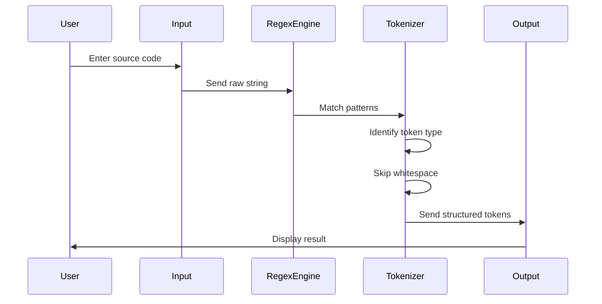
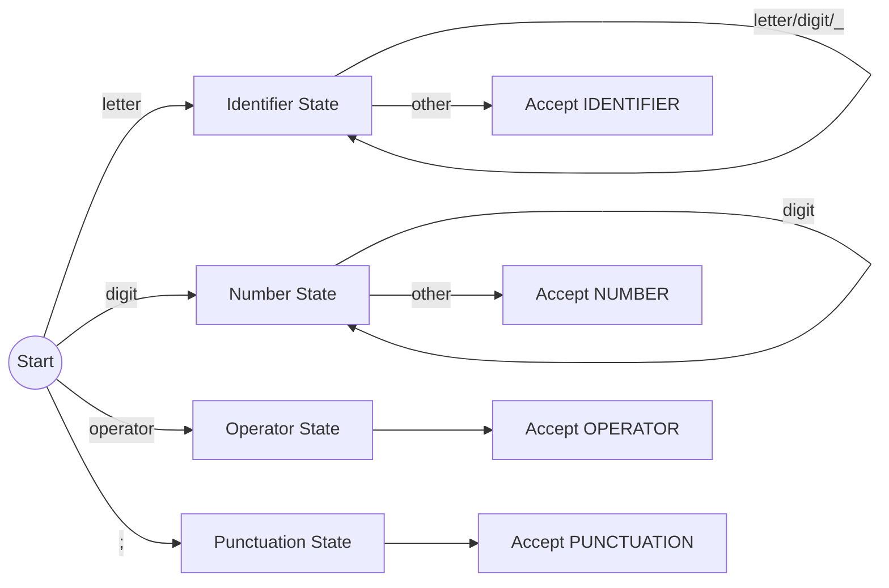

# ⚙️ Compiler Design – Task 1

### *Lexical Analysis using Python (Regex-Based Tokenizer)*

<p align="center">
  
  
  
  
  
</p>

---

<p align="center">
  
</p>

<p align="center">
  ⚙️ Lexical Analyzer in Action — Tokenizing Source Code into Meaningful Units
</p>

---

## 📌 Overview

This project implements a **Lexical Analyzer (Tokenizer)** the first phase of a compiler using Python and Regular Expressions.

It converts raw source code into structured **tokens**, forming the foundation for further stages like parsing and semantic analysis.

---

## ⚡ Quick Glance (10-sec overview)

* 🔍 Converts source code → tokens
* 🧠 Identifies keywords, identifiers, operators, numbers
* ⚙️ Regex-powered efficient scanning
* 📚 Core compiler foundation

---

## 🧠 A → Z Explanation

### 🔹 Input Code

```c
int sum=10;
```

---

### 🔹 Step-by-Step Transformation

#### 🟢 Step 1: Raw Input

```
int sum=10;
```

#### 🟡 Step 2: Regex Scanning Starts

```
[int] [ ] [sum] [=] [10] [;]
```

#### 🔵 Step 3: Pattern Matching

```
int  → KEYWORD  
sum  → IDENTIFIER  
=    → OPERATOR  
10   → NUMBER  
;    → PUNCTUATION  
```

#### 🟣 Step 4: Final Output Table

```
Token        | Type
-------------------------
int          | KEYWORD
sum          | IDENTIFIER
=            | OPERATOR
10           | NUMBER
;            | PUNCTUATION
```

---

## 🎬 Code Flow Animation (Step-by-Step)



---

## 🔄 Internal Code Execution Flow



---

## 🧩 Core Implementation

### 🔹 Token Patterns

```python
token_patterns = [
    ('KEYWORD',    r'\b(int|float|and|or|if|else|while)\b'),
    ('NUMBER',     r'\b\d+\b'),
    ('IDENTIFIER', r'\b[a-zA-Z_][a-zA-Z0-9_]*\b'),
    ('OPERATOR',   r'[=\+\-\*/]'),
    ('PUNCTUATION',r';'),
    ('WHITESPACE', r'\s+'),
]
```

---

### 🔹 Master Pattern

```python
master_pattern = '|'.join(f'(?P<{name}>{pattern})' for name, pattern in token_patterns)
```

✔ Combines all token rules into one optimized regex engine

---

### 🔹 Tokenization Logic

```python
for match in re.finditer(master_pattern, input_string):
```

✔ Scans → Matches → Classifies → Outputs

---

## 🧪 Example Execution

### 🔹 Input

```
int sum=10; and a+b= 20;
```

### 🔹 Output

| Token | Type        |
| ----- | ----------- |
| int   | KEYWORD     |
| sum   | IDENTIFIER  |
| =     | OPERATOR    |
| 10    | NUMBER      |
| ;     | PUNCTUATION |
| and   | KEYWORD     |
| a     | IDENTIFIER  |
| +     | OPERATOR    |
| b     | IDENTIFIER  |
| =     | OPERATOR    |
| 20    | NUMBER      |
| ;     | PUNCTUATION |

---

## 🧠 Debugger’s Insight (Expert Level)

* ✔ Regex priority ensures correct classification
* ✔ Named groups (`?P<>`) improve readability
* ✔ `finditer()` ensures sequential token detection
* ✔ Clean separation of logic improves scalability

---

## 🛠️ Tech Stack

* Python
* Regular Expressions (`re`)
* Compiler Design Concepts

---

## 🚀 Run

```bash
python Task_1.py
```

---

## 👤 Author

**Abdullah Al Mamun Zishan**  
🎓 CSE, Feni University  
📚 Batch: CSE 31st (UG)  
🆔 ID: 232031009  

🔗 https://www.linkedin.com/in/abdullah-al-mamun-zishan-606550282

---
