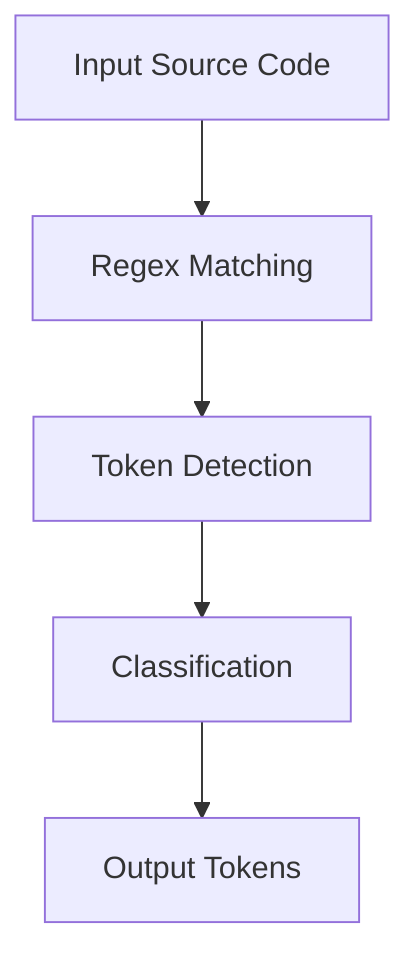

# ⚙️ Compiler Design – Task 1

### *Lexical Analysis using Python (Regex-Based Tokenizer)*

<p align="center">
  
  
  
  
  
</p>

---

<p align="center">
  
</p>

---

## 📌 Overview

This project implements a **Lexical Analyzer (Tokenizer)**, the first phase of a compiler using Python and Regular Expressions.

It processes raw source code and converts it into structured **tokens**, enabling further stages like parsing and semantic analysis.

---

## ⚡ Quick Glance (10-sec overview)

* 🔍 Converts source code → tokens
* 🧠 Identifies keywords, identifiers, operators, numbers
* ⚙️ Built using efficient regex-based pattern matching
* 📚 Core foundation of compiler design

---

## 🧠 What is Lexical Analysis?

Lexical Analysis scans source code and transforms it into token sequences.

### Example:

```c id="yfnptp"
int sum = 10;
```

⬇️ Output:

| Token | Type        |
| ----- | ----------- |
| int   | KEYWORD     |
| sum   | IDENTIFIER  |
| =     | OPERATOR    |
| 10    | NUMBER      |
| ;     | PUNCTUATION |

---

## 🧩 Core Implementation

### 🔹 Token Patterns

```python id="r9q6pq"
token_patterns = [
    ('KEYWORD',    r'\b(int|float|and|or|if|else|while)\b'),
    ('NUMBER',     r'\b\d+\b'),
    ('IDENTIFIER', r'\b[a-zA-Z_][a-zA-Z0-9_]*\b'),
    ('OPERATOR',   r'[=\+\-\*/]'),
    ('PUNCTUATION',r';'),
    ('WHITESPACE', r'\s+'),
]
```

---

### 🔹 Master Pattern

```python id="vy56pw"
master_pattern = '|'.join(f'(?P<{name}>{pattern})' for name, pattern in token_patterns)
```

✔ Combines all token rules into one optimized regex

---

### 🔹 Tokenization Logic

```python id="9p2rd7"
for match in re.finditer(master_pattern, input_string):
```

Steps:

1. Scan input sequentially
2. Match patterns
3. Identify token type
4. Ignore whitespace
5. Output structured result

---

## 🔄 Workflow



---

## 🧪 Example Execution

### 🔹 Input

```text id="h6xv3g"
int sum=10; and a+b= 20;
```

### 🔹 Output

| Token | Type        |
| ----- | ----------- |
| int   | KEYWORD     |
| sum   | IDENTIFIER  |
| =     | OPERATOR    |
| 10    | NUMBER      |
| ;     | PUNCTUATION |
| and   | KEYWORD     |
| a     | IDENTIFIER  |
| +     | OPERATOR    |
| b     | IDENTIFIER  |
| =     | OPERATOR    |
| 20    | NUMBER      |
| ;     | PUNCTUATION |

---

## 🛠️ Tech Stack

* **Language:** Python
* **Core Library:** re (Regular Expressions)
* **Concept:** Lexical Analysis
* **Domain:** Compiler Design

---

## 💡 Key Strengths

* ✔ Efficient pattern matching
* ✔ Clean and modular logic
* ✔ Strong foundation in compiler design
* ✔ Easily extendable for parser integration

---

## 🚀 How to Run

```bash id="0hkgny"
python Task_1.py
```

---

## 👤 Author

**Abdullah Al Mamun Zishan**
🎓 CSE, Feni University

🔗 LinkedIn: https://www.linkedin.com/in/abdullah-al-mamun-zishan-606550282

---

## ⭐ Final Impression

This project demonstrates a solid understanding of:

* Compiler fundamentals
* Pattern matching techniques
* Language processing systems

A strong stepping stone toward building **full compiler architectures**.
